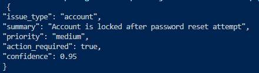
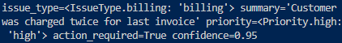

## Structured Data Extraction Pipeline

### :email: Email to Support Ticket - LLM Pipeline ###

This project demonstrates a production-style LLM pipeline that converts unstructured email text into structured support ticket using LangChain, Pydantic validation and retry logic

### :rocket: Project Overview ###

Email texts are converted to structured SupportTicket objects using:

1. LangChain
2. Pydantic schema validation
3. Hugging Face instruction-tuned model
4. Retry logic for validation failures

### 🏗️ Project Structure ###

- schemas.py (step 1- defining output schema)
- prompts.py (step 2- schema driven prompt)
- pipeline.py (step 3- langchain structured pipeline)
- retry_handler.py (step 4- validation & retry logic)
- test.py (unit tests for schema & prompt)
- main.py (entry point for pipeline execution)
- README.md

### :book: Implementation Steps ###

#### ✅ Step 1 - Define Output Schema (`schemas.py`) ####

- Pydantic `SUpportTicket` model
- Enum-based classification (`IssueType`, `Priority`)
- Field-level validation constraints

This ensures all outputs follow a strict structure

#### ✅ Step 2 - Schema-Driven Prompt (`prompts.py`) ####

- Explicit JSON structure instructions
- Enum value constraints included in prompt
- Designed to minimize hallucinated outputs

#### ✅ Testing Schema & Prompt (`test.py`) ####

In `test.py`, we validated that the prompt + schema logic works independently before building the full pipeline.

When passing an input email text, response was returned as a **structured dictionary**

**Example Input**

`Hi, my account is locked after I tried to reset my password.`

**Example Output**

#### ✅ Step 3 - Build LangChain Pipeline (`pipeline.py`) ####

- Integrated Hugging Face endpoint model
- Used `PydanticOutputParser`
- Enforced structured output parsing
- Deterministic configuration (`temperature=0`)

When executed via main.py, output is returned as a:

` Pydantic model instance (not a dictionary) `

This provides runtime type safety and validation environment

#### ✔️ Running the full pipeline ####

**Example Input**

`Hi, I was charged twice for my last invoice. Please help to fix this.`

**Example Output**

#### ✅ Step 4 - Validation & Retry Logic (`retry_handler.py`) ####

If model output fails validation:

- Extract the exact validation error
- Generate a corrective prompt
- Retry the model call
- Limit retry attempts

This improves reliability in real-world usage

### ✨ Planned Enhancements ###

- Step 5 - Batch processing model
- Step 6 - Logging & Observability
- Step 7 - Lightweight FastAPI endpoint

